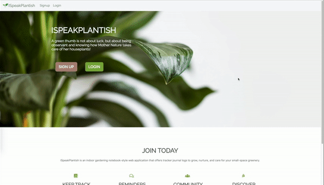
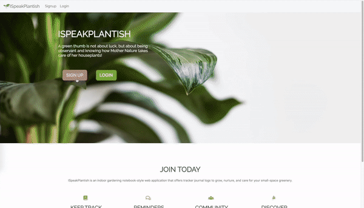

# ISpeakPlantish

ISpeakPlantish is a full-stack web application that acts as a houseplant journal for plant lovers. It offers tracker journal logs to grow, nurture, and care for your small-space greenery. <br/>

## Contents
* [Features](#features)
* [Technologies & Stack](#techstack)
* [Set-up & Installation](#installation)
* [About the Developer](#aboutme)

## <a name="features"></a>Features

User-friendly landing page
<br>
<br>

<br>

User registration, log-in, & log-out
<br>
<br>

<br>

Search common houseplants and add it to your plant collection
<br>
<br>

<br/>

Log journal entries to keep track of your plant's progress
<br>
<br>

<br/>

Text water and fertilizer reminders to yourself
<br>
<br>

<br>

Join group chats to discuss plant diagnosis, trade cuttings, or give freebies!
<br>
<br>

Learn about hundreds of common houseplants in our Homepage's Plant of the Moment section!
<br>
<br>


## <a name="techstack"></a>Technologies and Stack
**Backend:**
Python, Flask, SQLAlchemy, PostgreSQL, FlaskSocketIO <br/>
**Frontend:**
React, Javascript, jQuery, Babel, Bootstrap, Google Fonts, HTML5, CSS3 <br/>
**APIs:**
Cloudinary, Twilio


## <a name="installation"></a>Set-up & Installation
Install a code editor such as [VS code](https://code.visualstudio.com/download) or [Sublime Text](https://www.sublimetext.com/).<br/>
Install [Python3](https://www.python.org/downloads/mac-osx/)<br/>
Install [pip](https://pip.pypa.io/en/stable/installing/), the package installer for Python <br/>
Install [postgreSQL](https://www.postgresql.org/) for the relational database.<br/>


Clone or fork repository:
```
$ git clone https://github.com/anjelicasilva/ISpeakPlantish.git
```
Create and activate a virtual environment inside the ispeakplantish directory:
```
$ virtualenv env
$ source env/bin/activate
```
Install dependencies:
```
$ pip3 install -r requirements.txt
```
Make an account with [Cloudinary](https://cloudinary.com/documentation) & get an [API key](https://cloudinary.com/users/register/free).<br/>
Make an account with [Twilio](https://www.twilio.com/docs) & get an [API key](https://www.twilio.com/docs/usage/api).<br/>

Store these keys in a file named 'secrets.sh' <br/> 
```
$ source secrets.sh
```
With PostgreSQL, create the ISpeakPlantish database
```
$ createdb ispeakplantish_db
```
Create all tables and relations in the database and seed all data:
```
$ python3 -seed.py
```
Run the app from the command line:
```
$ python3 server.py
```


## <a name="aboutme"></a>About the Developer

ISpeakPlantish creator Anjelica Silva graduated from the University of CA, Los Angeles with a degree in Communication Studies and worked in property management shortly after. While volunteering and shadowing physicians in her free time, she made the decision to relocate to Hawaii to pursue further education in the health sciences. Turn of events, she relocated to San Francisco and while studying for the MCAT, found interest in programming. In due time, she fell in love with problem solving and realized her passion in technology and communication-related functions are what she finds most rewarding. She looks forward to building her skills and embarking her journey as a full-stack engineer post Hackbright. This is her first full-stack project. She can be found on [LinkedIn](https://www.linkedin.com/in/anjelicasilva/) and on [Github](https://github.com/anjelicasilva).

